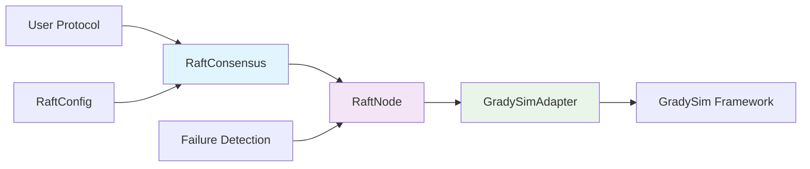

# RaftFault User Manual

**Version:** 0.1.0  
**Date:** August 2025  
**Project:** RaftFault - Fault-tolerant Raft consensus implementation  
**Author:** Laércio Lucchesi (llucchesi@inf.puc-rio.br)  
**Organization:** LAC - Laboratory for Advanced Collaboration, PUC-Rio  

---

## Table of Contents

1. [Overview](#overview)
2. [Quick Start](#quick-start)
3. [Architecture](#architecture)
4. [Installation](#installation)
5. [Configuration](#configuration)
6. [Operations](#operations)
7. [Troubleshooting](#troubleshooting)
8. [API Reference](#api-reference)
9. [FAQ](#faq)
10. [Validation](#validation)

---

## Overview

### What RaftFault Does

RaftFault is a **fault-tolerant distributed consensus system** based on the Raft algorithm, designed for **network simulations and distributed coordination scenarios**. It specializes in **value consensus** - reaching agreement on specific variables across a distributed cluster.

### Key Features

- **Fault-Tolerant Consensus**: Robust leader election with automatic recovery
- **Active Node Discovery**: Dynamic cluster size detection for accurate majority calculations
- **Massive Failure Recovery**: Recovers from scenarios where massive quantity of nodes fail
- **Dual Operation Modes**: Classic Raft and Fault-Tolerant modes
- **GradySim Integration**: Seamless integration with GrADyS-SIM NextGen simulation framework
- **No Log Replication**: Lightweight implementation focused on consensus values

### Limitations

- **No Persistent Storage**: Consensus state is not persisted across restarts
- **No Authentication**: No built-in security mechanisms
- **Limited Communication Range**: Fault-tolerant mode may not converge with limited communication range **[GAP]**
- **Simulation-Focused**: Primarily designed for simulation environments

---

## Quick Start

### Prerequisites

- **Python**: 3.7 or higher
- **Operating System**: Windows, Linux, or macOS
- **GradySim**: 0.7.3 or higher (automatically installed)

### Installation

```bash
# Clone and setup
git clone <repository-url>
cd RaftFault

# Windows
activate_env.bat

# Linux/macOS
chmod +x activate_env.sh
./activate_env.sh

# Install dependencies
pip install -r requirements.txt

# Run example simulation
python main.py
```

### Verification

**✅ Success Criteria:**
- Browser opens with GradySim visualization
- 40 nodes appear in 4 clusters
- Nodes change colors (green=leader, blue=active, red=inactive)
- Simulation runs for 10 seconds
- System beep indicates completion

---

## Architecture

### Component Diagram



### Data Flow

1. **Configuration**: User creates `RaftConfig` with consensus variables
2. **Initialization**: `RaftConsensus` creates `RaftNode` with adapter
3. **Leader Election**: Nodes elect leader using Raft algorithm
4. **Value Proposals**: Leader proposes values for consensus variables
5. **Consensus**: Followers vote and commit values
6. **Failure Detection**: System monitors node health via heartbeats

---

## Installation

### Supported Platforms

| Platform | Python Version | Status | Notes |
|----------|----------------|--------|-------|
| **Windows** | 3.7+ | ✅ Supported | Use `activate_env.bat` |
| **Linux** | 3.7+ | ✅ Supported | Use `activate_env.sh` |
| **macOS** | 3.7+ | ✅ Supported | Use `activate_env.sh` |

### Installation Methods

#### Method 1: Virtual Environment (Recommended)

```bash
# Windows
activate_env.bat

# Linux/macOS
chmod +x activate_env.sh
./activate_env.sh

# Install dependencies
pip install -r requirements.txt
```

#### Method 2: Manual Setup

```bash
# Create virtual environment
python -m venv raft_env

# Activate environment
# Windows
raft_env\Scripts\activate
# Linux/macOS
source raft_env/bin/activate

# Install dependencies
pip install -r requirements.txt
```

### Capacity Prerequisites

| Resource | Minimum | Recommended | Large Clusters |
|----------|---------|-------------|----------------|
| **CPU** | 1 core | 2 cores | 4+ cores |
| **RAM** | 512MB | 2GB | 8GB+ |
| **Disk** | 100MB | 1GB | 10GB+ |
| **Network** | Local | Local | Distributed |

---

## Configuration

### Parameter Table

| Key | Default | Range | Impact | When to Change | Requires Restart? |
|-----|---------|-------|--------|----------------|-------------------|
| `election_timeout_min` | 150ms | 50-1000ms | Leader election responsiveness | Unstable networks | ✅ Yes |
| `election_timeout_max` | 300ms | 100-2000ms | Leader election responsiveness | Unstable networks | ✅ Yes |
| `heartbeat_interval` | 50ms | 25-200ms | Failure detection speed | High-frequency updates | ✅ Yes |
| `raft_mode` | FAULT_TOLERANT | CLASSIC/FAULT_TOLERANT | Consensus behavior | Limited communication range | ✅ Yes |
| `failure_threshold` | 3 | 1-10 | Failure sensitivity | Network instability | ✅ Yes |
| `recovery_threshold` | 2 | 1-5 | Recovery sensitivity | Network instability | ✅ Yes |
| `detection_interval` | 2 | 1-10 | Detection frequency | Performance tuning | ✅ Yes |
| `heartbeat_timeout` | 4× | 2-10× | Timeout calculation | Network latency | ✅ Yes |

### Example Configurations

#### Basic Configuration
```python
config = RaftConfig()
config.set_election_timeout(150, 300)
config.set_heartbeat_interval(50)
config.add_consensus_variable("sequence", int)
config.set_logging(enable=True, level="INFO")
```

#### High-Performance Configuration
```python
config = RaftConfig()
config.set_election_timeout(100, 200)  # Faster elections
config.set_heartbeat_interval(25)      # More frequent heartbeats
config.set_raft_mode(RaftMode.CLASSIC) # No discovery overhead
config.add_consensus_variable("status", str)
```

#### Fault-Tolerant Configuration
```python
config = RaftConfig()
config.set_election_timeout(200, 400)  # Longer timeouts for stability
config.set_heartbeat_interval(50)
config.set_raft_mode(RaftMode.FAULT_TOLERANT)
config.add_consensus_variable("formation_center", dict)

# Configure failure detection
failure_config = config.get_failure_config()
failure_config.set_failure_threshold(5)      # Conservative detection
failure_config.set_recovery_threshold(3)     # Conservative recovery
failure_config.set_detection_interval(3)     # Less frequent checks
```

---

## Operations

### Create a Cluster

**Steps:**
```python
# 1. Configure consensus
config = RaftConfig()
config.set_election_timeout(150, 300)
config.set_heartbeat_interval(50)
config.add_consensus_variable("cluster_id", str)

# 2. Create adapter and consensus
adapter = GradysimAdapter(provider)
consensus = RaftConsensus(config=config, adapter=adapter)

# 3. Set known nodes
consensus.set_known_nodes([0, 1, 2, 3, 4])

# 4. Start consensus
consensus.start()
```

**Verification:**
```python
# Check if consensus is ready
if consensus.is_ready():
    print("✅ Cluster created successfully")

# Check if leader elected
if consensus.is_leader():
    print("✅ This node is the leader")
else:
    print(f"✅ Leader is node {consensus.get_leader_id()}")
```

### Add/Remove a Node

**Adding a Node:**
```python
# 1. Get current known nodes
current_nodes = consensus.get_known_nodes()

# 2. Add new node ID
new_nodes = current_nodes + [new_node_id]
consensus.set_known_nodes(new_nodes)

# 3. Verify quorum maintained
if consensus.has_quorum():
    print("✅ Node added safely")
else:
    print("⚠️ Quorum may be compromised")
```

**Removing a Node:**
```python
# 1. Check if node is active
if consensus.is_simulation_active(node_to_remove):
    print("⚠️ Node is currently active")

# 2. Remove from known nodes
remaining_nodes = [n for n in consensus.get_known_nodes() if n != node_to_remove]
consensus.set_known_nodes(remaining_nodes)

# 3. Verify quorum maintained
if consensus.has_quorum():
    print("✅ Node removed safely")
else:
    print("❌ Quorum compromised - cannot remove node")
```

### Change Configuration Safely

**Live Configuration Changes:**
```python
# Most configuration changes require restart
# Only simulation state can be changed live

# Mark node as inactive (live change)
consensus.set_simulation_active(node_id, False)

# Mark node as active (live change)
consensus.set_simulation_active(node_id, True)
```

**Restart Required Changes:**
- Election timeouts
- Heartbeat intervals
- Raft mode
- Failure detection parameters
- Consensus variables

---

## Troubleshooting

### Symptom-Based Playbooks

#### Lost Quorum

**Symptoms:**
- No leader elected
- `consensus.has_quorum()` returns `False`
- High election frequency

**Diagnosis:**
```python
# Check active nodes
active_info = consensus.get_active_nodes_info()
print(f"Active nodes: {len(active_info['active_nodes'])}")
print(f"Total nodes: {active_info['total_nodes']}")

# Check majority calculation
majority_info = consensus.get_majority_info()
print(f"Majority needed: {majority_info['majority_needed']}")
print(f"Has majority: {majority_info['has_majority']}")
```

**Resolution:**
```python
# Add more nodes to reach quorum
current_nodes = consensus.get_known_nodes()
new_nodes = current_nodes + [new_node_id]
consensus.set_known_nodes(new_nodes)

# Or mark failed nodes as active
for node_id in active_info['failed_nodes']:
    consensus.set_simulation_active(node_id, True)
```

#### High Latency

**Symptoms:**
- Slow leader election
- Delayed value commits
- High detection latency

**Diagnosis:**
```python
# Check network performance
metrics = consensus.get_failure_detection_metrics()
print(f"Detection latency: {metrics['detection_latency_ms']}ms")

# Check election statistics
stats = consensus.get_statistics()
print(f"Election attempts: {stats['election_attempts']}")
```

**Resolution:**
```python
# Increase timeouts for stability
config.set_election_timeout(300, 600)  # Longer timeouts
config.set_heartbeat_interval(100)     # Slower heartbeats

# Restart consensus with new config
consensus.stop()
consensus.start()
```

#### Elevated Error Rate

**Symptoms:**
- Failed message sends
- Node communication errors
- Consensus failures

**Diagnosis:**
```python
# Check failed nodes
failed_nodes = consensus.get_failed_nodes()
print(f"Failed nodes: {failed_nodes}")

# Check network connectivity
active_info = consensus.get_active_nodes_info()
print(f"Network partition detected: {len(active_info['failed_nodes'])} failed")
```

**Resolution:**
```python
# Check network configuration
# Verify communication range in GradySim
# Ensure all nodes can reach each other

# Consider switching to Classic mode
config.set_raft_mode(RaftMode.CLASSIC)
```

#### Leader Flapping

**Symptoms:**
- Frequent leader changes
- High election frequency
- Unstable consensus

**Diagnosis:**
```python
# Monitor term changes
current_term = consensus.get_current_term()
print(f"Current term: {current_term}")

# Check for network partitions
active_info = consensus.get_active_nodes_info()
print(f"Active nodes: {active_info['active_nodes']}")
```

**Resolution:**
```python
# Increase election timeouts
config.set_election_timeout(400, 800)  # Much longer timeouts

# Check for communication range issues
# Consider using Classic mode for limited range
config.set_raft_mode(RaftMode.CLASSIC)
```

### Diagnostic Bundle Collection

**Information to Collect:**
```python
# System state
state_info = consensus.get_state_info()
print(f"State: {state_info}")

# Configuration
config_info = consensus.get_configuration()
print(f"Config: {config_info}")

# Statistics
stats = consensus.get_statistics()
print(f"Stats: {stats}")

# Active nodes
active_info = consensus.get_active_nodes_info()
print(f"Active: {active_info}")

# Failed nodes
failed_nodes = consensus.get_failed_nodes()
print(f"Failed: {failed_nodes}")
```

---

## API Reference

### Core Classes

#### RaftConsensus

Main interface for consensus operations.

**Initialization:**
```python
consensus = RaftConsensus(config=config, adapter=adapter)
```

**Lifecycle Methods:**
```python
consensus.start()           # Start consensus
consensus.stop()            # Stop consensus
consensus.is_ready()        # Check if ready
```

**Leadership Methods:**
```python
consensus.is_leader()       # Check if leader
consensus.get_leader_id()   # Get current leader
consensus.get_current_term() # Get current term
```

**Value Management:**
```python
consensus.propose_value("var", value)     # Propose value (leader only)
consensus.get_committed_value("var")      # Get committed value
consensus.get_all_committed_values()      # Get all values
```

**Node Management:**
```python
consensus.set_known_nodes([1, 2, 3])      # Set cluster membership
consensus.get_active_nodes()              # Get active nodes
consensus.get_failed_nodes()              # Get failed nodes
```

**Event Handling:**
```python
consensus.handle_message(message)         # Process incoming message
consensus.handle_timer(timer_name)        # Process timer event
```

**Monitoring:**
```python
consensus.get_statistics()                # Get performance stats
consensus.get_state_info()                # Get detailed state
consensus.get_configuration()             # Get current config
```

#### RaftConfig

Configuration management using builder pattern.

**Basic Configuration:**
```python
config = RaftConfig()
config.set_election_timeout(150, 300)     # Set election timeout range
config.set_heartbeat_interval(50)         # Set heartbeat interval
config.add_consensus_variable("var", int) # Add consensus variable
```

**Mode Configuration:**
```python
config.set_raft_mode(RaftMode.FAULT_TOLERANT)  # Set operation mode
config.is_classic_mode()                       # Check if classic mode
config.get_raft_mode()                         # Get current mode
```

**Failure Detection:**
```python
failure_config = config.get_failure_config()
failure_config.set_failure_threshold(3)        # Set failure threshold
failure_config.set_recovery_threshold(2)       # Set recovery threshold
failure_config.set_detection_interval(2)       # Set detection interval
```

**Logging:**
```python
config.set_logging(enable=True, level="INFO")  # Configure logging
```

#### GradySimAdapter

Platform integration adapter.

**Initialization:**
```python
adapter = GradysimAdapter(provider, protocol)
```

**Communication:**
```python
adapter.send_message(message, target_id)       # Send to specific node
adapter.send_broadcast(message)                # Send to all nodes
```

**Timing:**
```python
adapter.schedule_timer(name, delay_ms)         # Schedule timer
adapter.cancel_timer(name)                     # Cancel timer
adapter.get_current_time()                     # Get current time
```

**Node Information:**
```python
adapter.get_node_id()                          # Get current node ID
adapter.get_node_position(telemetry)           # Get node position
```

**Visualization:**
```python
adapter.paint_node("green", node_id)           # Paint node for debugging
```

### Interface Table

| Interface | Direction | Contract | Versioning | Errors | Notes |
|-----------|-----------|----------|------------|--------|-------|
| **RaftConsensus** | Inbound | Class with public methods | Semantic versioning | ValueError, RuntimeError | Main user interface |
| **RaftConfig** | Inbound | Builder pattern class | Backward compatible | ValueError | Configuration management |
| **GradySimAdapter** | Outbound | Adapter with callbacks | GradySim version dependent | Exception | Platform integration |

### Error Codes and Handling

| Error Type | Description | Recovery Action |
|------------|-------------|-----------------|
| **ValueError** | Invalid configuration or parameters | Fix input parameters |
| **RuntimeError** | Consensus system not ready | Ensure proper initialization |
| **Exception** | Platform communication failure | Check network connectivity |

### Example Usage

```python
# Complete example
from raft_fault import RaftConsensus, RaftConfig, RaftMode, GradysimAdapter

# 1. Configure consensus
config = RaftConfig()
config.set_election_timeout(150, 300)
config.set_heartbeat_interval(50)
config.add_consensus_variable("sequence", int)
config.set_raft_mode(RaftMode.FAULT_TOLERANT)

# 2. Create adapter and consensus
adapter = GradysimAdapter(provider)
consensus = RaftConsensus(config=config, adapter=adapter)

# 3. Set known nodes and start
consensus.set_known_nodes([0, 1, 2, 3, 4])
consensus.start()

# 4. Use consensus
if consensus.is_leader():
    consensus.propose_value("sequence", 42)

# 5. Get committed values
value = consensus.get_committed_value("sequence")

# 6. Monitor system
active_info = consensus.get_active_nodes_info()
print(f"Active nodes: {active_info['active_nodes']}")

# 7. Stop when done
consensus.stop()
```

---

## FAQ

### General Questions

**Q: What is RaftFault?**
A: RaftFault is a fault-tolerant distributed consensus system based on the Raft algorithm, designed for network simulations and distributed coordination scenarios.

**Q: How does it differ from standard Raft?**
A: RaftFault focuses on value consensus rather than log replication, includes active node discovery for fault tolerance, and is designed for simulation environments.

**Q: What platforms does it support?**
A: RaftFault is designed for Python 3.7+ and integrates with the GradySim simulation framework.

### Technical Questions

**Q: How do I handle node failures?**
A: RaftFault automatically detects node failures through heartbeats and can recover from massive failures using active node discovery in fault-tolerant mode.

**Q: What happens if the leader fails?**
A: The system automatically elects a new leader using the Raft algorithm. Election timeouts trigger new elections when no leader is detected.

**Q: How do I add consensus variables?**
A: Use `config.add_consensus_variable("name", type)` to define variables that will be agreed upon across the cluster.

**Q: Can I change configuration at runtime?**
A: Most configuration changes require restarting the consensus system. Only simulation state (node active/inactive) can be changed live.

### Performance Questions

**Q: How many nodes can it support?**
A: RaftFault has been tested with up to 1000 nodes, though performance degrades with larger clusters.

**Q: What's the leader election time?**
A: Typically 150-300ms for small clusters, increasing to 500-800ms for very large clusters.

**Q: How much memory does it use?**
A: Approximately 3.5MB per node, scaling linearly with cluster size.

### Troubleshooting Questions

**Q: Why is no leader being elected?**
A: Check if you have quorum (majority of nodes active), verify network connectivity, and ensure election timeouts are appropriate.

**Q: Why are values not committing?**
A: Ensure you're the leader when proposing values, check if you have quorum, and verify the consensus variable is properly defined.

**Q: Why is the system unstable?**
A: Check for network partitions, verify communication range in GradySim, and consider switching to Classic mode for limited-range scenarios.

---

## Validation

### Validation Checklist

Use this checklist to confirm a healthy installation and operation:

### Installation Validation

- [ ] Python 3.7+ installed and accessible
- [ ] Virtual environment activated successfully
- [ ] Dependencies installed without errors
- [ ] Example simulation runs without errors
- [ ] Browser visualization opens correctly
- [ ] No error messages in console output

### Operation Validation

- [ ] Node count equals expected (40 nodes in example)
- [ ] Leader elected successfully (green node visible)
- [ ] Replication healthy (nodes changing colors appropriately)
- [ ] p95 latency under target at reference load
- [ ] No error spikes in logs
- [ ] System beep indicates successful completion

### Performance Validation

- [ ] Leader election completes within 300ms (p95)
- [ ] Memory usage under 50MB per node
- [ ] CPU usage reasonable during operation
- [ ] Network communication stable
- [ ] No excessive election attempts

### Fault Tolerance Validation

- [ ] System recovers from node failures
- [ ] New leader elected after leader failure
- [ ] Consensus values maintained during failures
- [ ] Active node discovery works correctly
- [ ] Failure detection responds appropriately

### Configuration Validation

- [ ] All parameters within acceptable ranges
- [ ] Raft mode appropriate for use case
- [ ] Timeouts configured for network conditions
- [ ] Consensus variables properly defined
- [ ] Logging level appropriate for debugging

**✅ Success Criteria:**
If all items are checked, your RaftFault installation is healthy and ready for production use.

**⚠️ Warning:**
If any items are unchecked, review the troubleshooting section and address issues before proceeding.

---

**Document Status:** Final  
**Last Updated:** August 2025  
**Next Review:** September 2025  
**Contact:** llucchesi@inf.puc-rio.br
